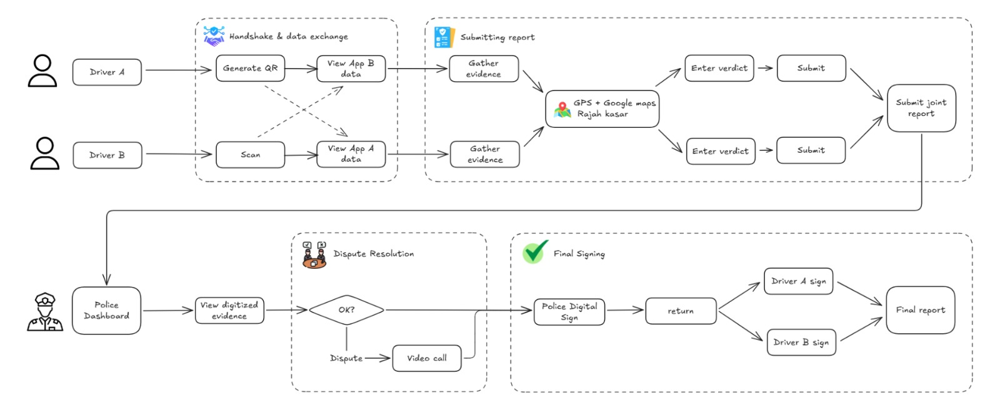

<p align="center">
  
</p>

<p align="center">
  <strong>Digital Accident Resolution Platform</strong><br/>
  Report minor road accidents without visiting a police station — verified through <strong>MyDigital ID</strong>.
</p>

## The Problem

Current accident reporting in Malaysia is inefficient and stressful:

- **Traffic Congestion**: Minor accidents block roads for hours because drivers are afraid to move, and discussions take time.
- **Trust Issue**: Drivers currently rely on checking physical ICs because there is no guarantee the person is who they claim to be.
- **Wasted Time**: Citizens must visit the police station, often resulting in an average wait of 3 hours.
- **Outdated e-Reporting**: Existing e-Reporting systems only support single-vehicle accidents and still require manual data entry and sketching.

## System Architecture



## The Solution

MySettle is an end-to-end platform that allows citizens to lodge reports and allows Police IOs (Investigating Officers) to investigate remotely.

- **The Digital Handshake**: Driver A scans Driver B's QR code to instantly verify identity and license details on both devices.

- **Trusted Evidence**: Drivers take pictures and videos of the scene using MySettle. The app provides clear guidance on how to take evidence, removing the need for an investigator at the scene.

- **Smart Data Collection**: The app auto-generates the "Rajah Kasar" (rough sketch) using Google Maps API, and auto-fills location (GPS) and weather data.

- **Seamless Web Portal**: Police Investigating Officers (IOs) can access a dedicated **Web App** to review cases, evaluate evidence, and generate official reports in real-time, fully synchronized with the mobile app.

- **Insurance Ready**: Once the investigation is complete, users can directly **download all necessary documents/reports** (e.g., Repot Polis, Rajah Kasar) from the mobile app to proceed with insurance claims immediately.

- **3-way Virtual Meeting**: In the case of a dispute, the police can arrange a conference meeting between the Police, Driver A, and Driver B.

## Technical Concepts

### Real-Time Synchronization (SSE)
We utilize **Server-Sent Events (SSE)** for our API architecture to ensure real-time synchronization between users. This allows for instant updates during the critical "Digital Handshake" phase without the battery drain of constant polling.

### Secure Session Workflow
1.  **Session Creation**: Driver A creates a secure session on their device.
2.  **Handshake**: Driver B scans Driver A's QR code to join that specific session context.
3.  **Independent Reporting**: Both drivers fill out their accident details independently on their own devices.
4.  **Police Submission**: The case **only** appears on the PDRM Web Dashboard for IO review once **BOTH** Driver A and Driver B have successfully submitted their reports. This ensures complete data integrity and prevents incomplete case filings.

## Impact

*Saving Time, Saving Lives, No Panic*

### Citizen

- **Convenience**: No need to panic when an accident happens, just pull out mySettle.
- **Time Saving**: No need to go and wait at the police station for the report.
- **Safety**: Get off the road faster, keep safe, and avoid traffic jams.

### Police IOs

- **Efficiency**: Digital data entry eliminates 30 minutes of typing per case.

### Nation

- **Data**: Accurate, geo-tagged accident data helps MIROS fix dangerous roads ("Blackspots").

## Getting Started

### Prerequisites
- Node.js (v18+)
- Expo CLI
- Expo Go app (for mobile testing)

### Installation

```bash
# Install dependencies
npm install

# Start development server
npx expo start --clear
```